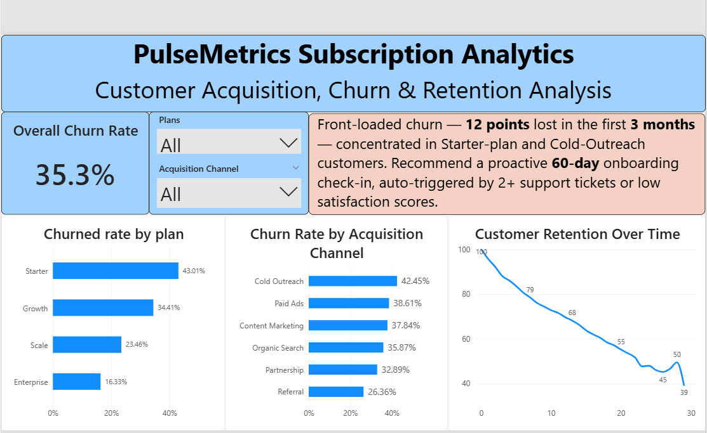

# PulseMetrics — SaaS Churn & Retention Analysis

**Tools:** MySQL (SQL) · Power BI (DAX, dashboarding)
**Type:** Portfolio project — synthetic SaaS subscription dataset (1,500 customers, Jan 2023–Jun 2025)

> **Note on the data:** This uses a synthetically generated dataset built to mirror realistic
> SaaS subscription behavior (signups, plan tiers, cancellations, support tickets, usage).
> It is not real company data. The churn drivers built into the data (plan tier, acquisition
> channel, support friction) are intentional, so the analysis below reflects genuine patterns
> in the dataset — the methodology is what's being demonstrated.

## Business Context

PulseMetrics is a fictional B2B SaaS company. Leadership wants to know: **who is churning,
when, and why** — and whether the support experience customers have is part of the story.

## Finding

PulseMetrics loses 12 points of retention in the first 3 months alone (100% → 88.1%) —
nearly half of all first-year churn happens in this window. This front-loaded risk is
concentrated in Starter-plan (43.0% churn) and Cold-Outreach-acquired (42.5% churn)
customers, and support ticket volume is also a leading churn indicator.

**Recommendation:** A proactive onboarding check-in program for new Starter-plan and
Cold-Outreach customers in their first 60 days — auto-triggered the moment a customer opens
2+ support tickets or logs a low satisfaction score, rather than waiting for them to churn
silently.

## Dashboard



## Methodology

1. **Data generation** — synthetic multi-table SaaS dataset (customers, plans, subscriptions,
   monthly usage, support tickets), with churn driven by a hidden per-customer "friction"
   variable that also drives support ticket volume/satisfaction — so the churn-support
   correlation found below is a genuine, discoverable pattern, not a coincidence.
2. **SQL analysis** (MySQL) — see `/sql`:
   - `01_churn_rate.sql` — overall churn rate + breakdown by plan and acquisition channel,
     using conditional aggregation (`CASE` inside `SUM`)
   - `02_cohort_retention.sql` — per-cohort retention curve. Customers are grouped by signup
     month, then a **recursive CTE** generates month-offset checkpoints (0, 1, 2, ...) and a
     **window function** (`FIRST_VALUE`) normalizes each cohort against its own starting size.
     This step matters because a flat churn rate hides *censoring* — a customer who signed up
     last month hasn't had time to churn yet, which quietly biases a single overall percentage.
   - `03_blended_retention.sql` — a single business-wide retention curve, weighted by actual
     cohort size (not a naive average of per-cohort percentages, which would treat a 22-person
     cohort the same as a 72-person one).
3. **Dashboard** (Power BI) — churn rate KPI, churn % by plan and channel (DAX measures using
   `DIVIDE`), and the blended retention curve, with working filters by plan and acquisition
   channel.

## Repo Structure

```
├── README.md
├── sql/
│   ├── 01_churn_rate.sql
│   ├── 02_cohort_retention.sql
│   └── 03_blended_retention.sql
└── dashboard/
    └── pulsemetrics_dashboard.png
```
